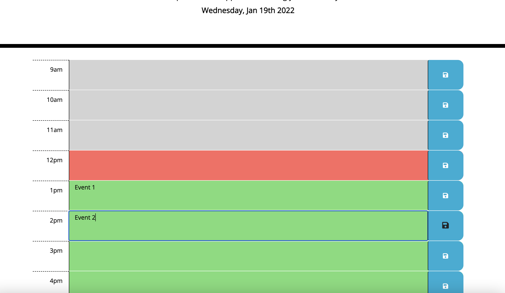

# Work Day Scheduler

## Description

This is a simple work day scheduler. It allows you to schedule your work day and it will display if the time is past, present, or future. It will save your schedule on local storage and on refresh, it will load your schedule from local storage.

## Mockup

## Screenshots

## Development

- Deployed application: [Live URL](https://jimenezraul.github.io/work-day-scheduler/)